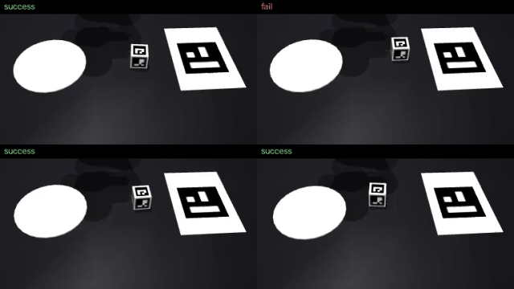

# ego2franka

Phone videos of a hand doing a task → the hand's motion replayed by a Franka in a MuJoCo copy of
the same table → SmolVLA.


I recorded 50 clips of my hand moving a cube onto a plate with a fixed iPhone. Nothing else was
measured: the camera is calibrated from the clips themselves, the hand is tracked in 3D, and the
same scene is rebuilt in MuJoCo with a camera where the phone was. A Franka's gripper follows the
tracked hand there, and those replays are the only training data for SmolVLA.

The clips are third-person, from a fixed phone — not egocentric.

## Results

Cube onto plate. SmolVLA fine-tuned from `lerobot/smolvla_base` (VLM frozen, one simulated phone
camera, no wrist camera). Success = cube resting on the plate, gripper open and withdrawn, on
unseen start positions inside the 9 × 5 cm area the clips cover.

| demonstrations | clips used | success |
|---|---|---|
| gripper follows the tracked hand | 30 | **74 %** (50 trials) |
| the same, ten clips only | 10 | 60 % (30 trials) |
| with every correction listed below | 50 | 84 % (50 trials) |



"Follows the tracked hand" means: tool point = pinch point, yaw = thumb–index direction, gripper
closed from the frame the cube is seen to leave the table until it is seen to arrive. 30 of the 50
clips put the cube on the plate when replayed that way, and only those are used. The policy
trained on them is also 20 % quicker (144 against 186 control steps) because it keeps the hand's
pace.

Outside the covered area the policy fails (with the corrected demonstrations: 40 % up to 4 cm
outside, 26 % up to 8 cm). It reaches for a place it has seen: the grasp misses by about 1.5 × the
distance the cube is outside.

## How a clip becomes a demonstration

1. **Camera from the clips** — [`e2f/calibrate.py`](e2f/calibrate.py). The phone never moves, so
   the first frames of all clips show the same table marker and the cube at 50 places. One bundle
   adjustment gives focal length (1788 px), camera pose and cube size, 0.56 px reprojection error.
   Scale comes from the A4 sheet the marker is printed on.
2. **Hand in 3D** — [`e2f/hand_mano.py`](e2f/hand_mano.py), [`e2f/perception.py`](e2f/perception.py).
   WiLoR regresses MANO parameters per frame; the 21 joints are registered to the image by PnP
   with the calibrated camera. Depth from one camera is the weak direction, so each clip is
   anchored where depth is known: at grasp and at release the pinch point is at the cube.
   MediaPipe is the fallback when MANO is not available; before anchoring its pinch point is
   8.0 cm off along the viewing ray at contact, MANO's 2.9 cm.
3. **The same table in MuJoCo** — [`e2f/sim.py`](e2f/sim.py). Cube with its markers, plate, marker
   sheet, and a camera with the phone's pose and field of view. ArUco detection on the rendered
   image lands within 1–2.5 px (at 1080p) of the detection on the real frame.
4. **Hand → gripper** — [`e2f/retarget.py`](e2f/retarget.py).
5. **Train and evaluate** — `lerobot-train`, then [`e2f/evaluate.py`](e2f/evaluate.py) rolls the
   policy out closed loop: predict a 50-step chunk, execute 10 steps, look again.

### How much of the hand's motion survives

Each row adds one change to the row above and counts the clips whose replay puts the cube on the
plate.

| end-effector targets | MediaPipe | MANO |
|---|---|---|
| position, yaw and finger opening straight from the hand | 5 / 50 | 8 |
| open / close from when the cube is seen to leave and to arrive | 15 | 26 |
| never below the grasp height | 20 | 32 |
| one grasp orientation instead of the hand's | 26 | 32 |
| wait for the fingers to close / open; pass above the cube until over it | 30 | 36 |
| carry at least 3 cm above the table | 32 | 37 |
| stop above the cube and come straight down; leave straight up | 50 | 50 |

The third row is what "follows the tracked hand" uses. The distance between the fingertips was
the one signal that could not be used: it goes from 6.6 to 5.0 cm between open and holding, less
than its clip-to-clip scatter. With MANO the hand's own orientation is good enough to keep
(fourth row).

The hand-back marker turned out to be visible in about 10 % of frames, and the cube's markers in
about 3 % of the frames in which it is carried (the thumb covers them), so neither could carry the
tracking.

### Two things about demonstrations that cost success

Found by looking at the data, both settled without touching the model or the clips.

| | success |
|---|---|
| grasp orientation chosen clip by clip, landing on three different grasps for the same scene | about 50 %, not improving with training |
| one orientation for the whole dataset | 84–92 % |

A simulated wrist camera added nothing (44–54 % against 46–66 % in the same setting), so the
policy sees only what the phone saw.

## Cup stacking


A second recording: 10 clips of stacking a green cup into a blue one and a pink one on top.
No markers. Code: [`e2f/cups_perception.py`](e2f/cups_perception.py),
[`e2f/cups_sim.py`](e2f/cups_sim.py), [`e2f/cups_retarget.py`](e2f/cups_retarget.py).

- Cups are found by colour and a truncated-cone model is fitted to each outline through the
  calibrated camera. Base diameter and height were measured with a ruler (55 and 90 mm), the rim
  (73 mm) comes from the fit. The simulated cups are hollow and really nest.
- The arm hides the hand in most frames of these clips, so a clip contributes where the cups stand
  and in which order they move; the motion in between is a plain lift–carry–lower.
- Pinching one side of the rim, as the hand does, let the cup swing round the pinch and miss the
  cup below. Taking it across the rim from outside (73 mm in an 80 mm gripper) makes it hang like
  a bucket; with that, all 10 replays stack both cups.

SmolVLA trained on those 10 demonstrations stacks both cups in 27 % of 30 trials and the first
one in 40 %.

| demonstrations | both cups stacked |
|---|---|
| arm waits so that each pick happens when it does in the clip, and pauses above each cup | 7 % |
| no waiting; slows down above a cup and keeps moving | 27 % |

Stationary frames teach the policy to stay put. Starting the arm elsewhere, larger images,
executing more of each predicted chunk, and nudging the arm off course during the replays did not
move the 27 %. What remains is precision: one cup enters another with 7 mm to spare, and with 10
demonstrations the policy is not that accurate, so it tips the lower cup over.

## RL post-training: not working yet

Starting point: the policy trained on ten hand-following clips (60 %).

**OTQL** ([Sochopoulos et al.](https://arxiv.org/abs/2607.06262); [`e2f/otql.py`](e2f/otql.py) is
my reading of the paper, not the authors' code). Five rounds of ten rollouts, a critic on the
frozen VLM's features, advantage-weighted optimal-transport flow matching on the action head.
Success stayed where it was: 57 → 60 → 57 → 60 % on the same 30 scenes. The paper leaves the
temperature, the critic's inputs and the update budget open, and I have not found values that
work. Sampling with 3 flow steps instead of 10 costs nothing here, but that is already true of
the base policy (17 / 30 with 10 steps, 17 / 30 with 3, 15 / 30 with 1), so it is not something
the post-training bought.

Earlier attempts, on the corrected demonstrations:

- *Keep the policy's own successes and retrain* ([`e2f/improve.py`](e2f/improve.py)). No gain on
  wider positions (successes only occur where the policy already works) and none on speed (which
  rollout is fast is mostly chance).
- *PPO on the flow policy, after [KinetIQ Ascend](https://thehumanoid.ai/technology/kinetiq-ascend/)*.
  Collapsed or decayed in three runs, so it is not in the repository. Two things learned: SmolVLA
  runs in bfloat16, where the same input gives log-probabilities that differ by up to 0.5
  depending on what else is in the batch (float32 fixes it); and a likelihood that only sees the
  explored directions leaves the rest of a 100 M-parameter head free to drift.

## Run it

```bash
uv venv --python 3.12 && uv pip install -e .

# cube task; data/tracks/ is included, so the first three steps need the raw clips only if you want to redo them
python -m e2f.calibrate                                         # data/raw/*.MOV -> data/calib.json
scripts/setup_hand_env.sh                                       # separate environment for WiLoR; MANO_RIGHT.pkl from mano.is.tue.mpg.de
.venv-hand/bin/python -m e2f.hand_mano "data/raw/*.MOV" data/hands
python -m e2f.perception                                        # -> data/tracks/*.npz
python -m e2f.retarget --follow                                 # hand-following replays -> data/lerobot/demos_follow
python -m e2f.retarget                                          # fully corrected replays -> data/lerobot/demos_phone

lerobot-train --policy.path=lerobot/smolvla_base \
    --dataset.repo_id=local/ego2franka_demos --dataset.root=data/lerobot/demos_follow --dataset.video_backend=pyav \
    --rename_map='{"observation.images.phone": "observation.images.camera1"}' \
    --batch_size=64 --steps=10000 --output_dir=outputs/train/bc_follow --policy.push_to_hub=false --wandb.enable=false

python -m e2f.evaluate outputs/train/bc_follow/checkpoints/last/pretrained_model --episodes 50 [--margin 0.04]
python -m e2f.otql outputs/train/bc_follow10/checkpoints/last/pretrained_model   # after training on ten clips with --dataset.episodes

# cup stacking
python -m e2f.cups_perception && python -m e2f.cups_retarget
# train as above with --dataset.root=data/lerobot/cups_demos, then
python -m e2f.evaluate outputs/train/cups_bc/checkpoints/last/pretrained_model --task cups
```

Trained on one RTX 5090; a 10 000-step run takes about 45 minutes and 17 GB.

## Credits

Franka model from [MuJoCo Menagerie](https://github.com/google-deepmind/mujoco_menagerie)
(Apache-2.0). Hand tracking with [WiLoR](https://github.com/rolpotamias/WiLoR) and the
[MANO](https://mano.is.tue.mpg.de) hand model (both research-only licences; neither is
redistributed here), fallback [MediaPipe](https://developers.google.com/mediapipe).
SmolVLA and the dataset format from [LeRobot](https://github.com/huggingface/lerobot).
