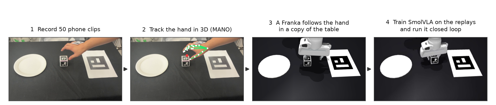
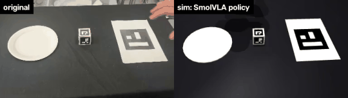
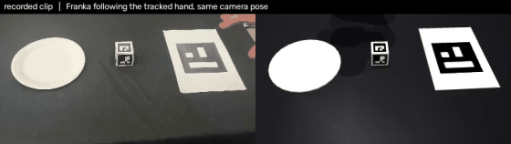
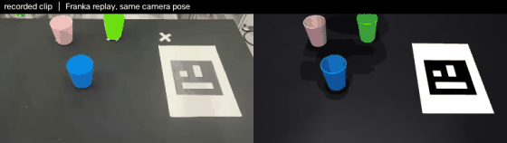

# hand2franka

I filmed my hand moving a cube onto a plate, 50 times, with a phone. This repository turns those
videos into robot demonstrations in simulation and trains SmolVLA on them.





*Left: one of my clips. Right: SmolVLA, trained only on data made from those clips, doing the task
in a simulated copy of my table, seen from where the phone stood.*

## Result

SmolVLA is fine-tuned on the simulated replays of my clips, then tested in simulation on cube
positions it has not seen (same area of the table as in the clips).

| trained on | success |
|---|---|
| all 50 clips | **84 %** |
| the 30 clips in which the robot can copy my hand exactly | 74 % |
| 10 of those clips | 60 % |

In 30 of the 50 clips the robot can do exactly what my hand did and the cube ends up on the plate.
In the other 20 it cannot (the tracked hand is a few centimetres off in depth, or moves faster
than the arm), so for the "all 50 clips" row the motion is adjusted — see the table below.

## How it works

1. **Camera** ([`h2f/calibrate.py`](h2f/calibrate.py)). No calibration target: the phone never
   moves, so the table marker and the cube seen at 50 places are enough to solve for the focal
   length, the camera pose and the cube size (0.56 px error).
2. **Hand** ([`h2f/hand_mano.py`](h2f/hand_mano.py), [`h2f/perception.py`](h2f/perception.py)).
   WiLoR fits the MANO hand model to every frame. One camera gives poor depth, so each clip is
   pinned where depth is known: at grasp and at release the fingers are at the cube.
3. **Simulation** ([`h2f/sim.py`](h2f/sim.py), [`h2f/retarget.py`](h2f/retarget.py)). The table is
   rebuilt in MuJoCo with a camera where the phone was (markers in the rendered image land within
   2.5 px of the real ones). The Franka's gripper follows the tracked hand, and what the simulated
   camera sees becomes the training data.

   
4. **Policy** ([`h2f/evaluate.py`](h2f/evaluate.py)). SmolVLA is trained with `lerobot-train` and
   run closed loop: predict 50 steps, execute 10, look again.

### How much of my hand's motion the robot can copy

Each row adds one change to the row above. The number is how many of the 50 clips still put the
cube on the plate when the robot replays them.

| the robot's gripper | clips that work |
|---|---|
| copies the hand's position, rotation and finger opening | 8 / 50 |
| opens and closes when the cube is seen to leave and to arrive, not by finger distance | 26 |
| is not allowed below the table | 32 |
| waits for its fingers to close; passes above the cube until over it; carries 3 cm high | 37 |
| stops above the cube and comes straight down | 50 |

The 74 % policy uses the third row, the 84 % policy the last one.

## Cup stacking



A second set of 10 clips: a green cup into a blue one, then a pink one on top
([`h2f/cups_perception.py`](h2f/cups_perception.py), [`h2f/cups_sim.py`](h2f/cups_sim.py),
[`h2f/cups_retarget.py`](h2f/cups_retarget.py)). The cups have no markers; they are found by
colour and a cup-shaped model is fitted to their outline. All 10 clips replay correctly in
simulation. SmolVLA trained on them stacks both cups in 27 % of trials: a cup fits into another
with 7 mm to spare, and 10 demonstrations do not make the policy that precise.

## What did not work

- **RL post-training.** I tried to improve the 50-clip policy with its own experience in
  simulation. Neither attempt moved the success rate beyond what repeating the evaluation moves it.
  - *Residual RL* ([`h2f/residual.py`](h2f/residual.py)): SmolVLA stays frozen and a small network,
    trained with TD3 on the simulator's state, adds up to 1 cm to each target. After 559 episodes:
    86 % → 88 % on 100 new scenes.
  - *OTQL* ([paper](https://arxiv.org/abs/2607.06262); [`h2f/otql.py`](h2f/otql.py) is my reading
    of it, not the authors' code), which retrains the action head on the actions a learned critic
    rates above average. After 50 rollouts: 80 % → 77 % on 30 scenes. The critic can tell a good
    situation from a bad one (0.9 AUC on held-out rollouts) but barely reacts to which action is
    taken, so its ratings of the actions say little.
  - Keeping only the policy's own successes and retraining ([`h2f/improve.py`](h2f/improve.py))
    did not help either.
- **Cube positions outside the area of the clips.** 4 cm outside, success drops to 40 %; 8 cm
  outside, to 26 %. The policy reaches for a place it has seen.
- **Copying the finger opening.** The distance between my fingertips changes by 1.6 cm between
  open and holding, less than it varies from clip to clip.

## Run it

```bash
uv venv --python 3.12 && uv pip install -e .

# data/tracks/ is included, so the first four steps are only needed to redo them from the raw clips
python -m h2f.calibrate                                          # data/raw/*.MOV -> data/calib.json
scripts/setup_hand_env.sh                                        # WiLoR; MANO_RIGHT.pkl from mano.is.tue.mpg.de
.venv-hand/bin/python -m h2f.hand_mano "data/raw/*.MOV" data/hands
python -m h2f.perception                                         # -> data/tracks/*.npz

python -m h2f.retarget                                           # all 50 clips -> data/lerobot/demos_phone
python -m h2f.retarget --follow                                  # hand copied exactly -> data/lerobot/demos_follow

lerobot-train --policy.path=lerobot/smolvla_base \
    --dataset.repo_id=local/hand2franka_demos --dataset.root=data/lerobot/demos_phone --dataset.video_backend=pyav \
    --rename_map='{"observation.images.phone": "observation.images.camera1"}' \
    --batch_size=64 --steps=10000 --output_dir=outputs/train/bc --policy.push_to_hub=false --wandb.enable=false

python -m h2f.evaluate outputs/train/bc/checkpoints/last/pretrained_model --episodes 50
python -m h2f.residual outputs/train/bc/checkpoints/last/pretrained_model
python -m h2f.otql outputs/train/bc/checkpoints/last/pretrained_model --corrected --advantage td

# cup stacking
python -m h2f.cups_perception && python -m h2f.cups_retarget
python -m h2f.evaluate outputs/train/cups_bc/checkpoints/last/pretrained_model --task cups
```

One RTX 5090; training takes about 45 minutes.

## Credits

Franka model from [MuJoCo Menagerie](https://github.com/google-deepmind/mujoco_menagerie).
Hand tracking with [WiLoR](https://github.com/rolpotamias/WiLoR) and the
[MANO](https://mano.is.tue.mpg.de) hand model (research-only licences, not redistributed here).
SmolVLA and the dataset format from [LeRobot](https://github.com/huggingface/lerobot).
